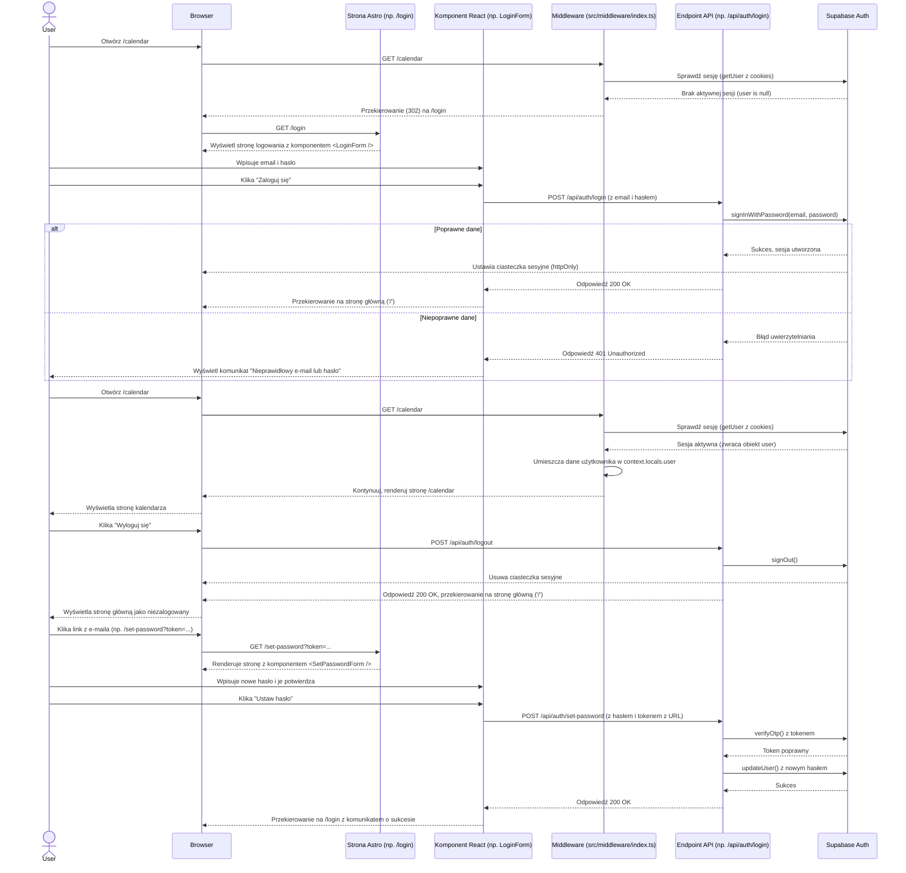

```mermaid
sequenceDiagram
    actor User
    participant Browser
    participant AstroPage as Strona Astro (np. /login)
    participant ReactForm as Komponent React (np. LoginForm)
    participant AstroMiddleware as Middleware (src/middleware/index.ts)
    participant APIEndpoint as Endpoint API (np. /api/auth/login)
    participant SupabaseAuth as Supabase Auth

    %% --- SCENARIUSZ 1: Dostęp do strony chronionej (niezalogowany) ---

    User->>Browser: Otwórz /calendar
    Browser->>AstroMiddleware: GET /calendar
    AstroMiddleware->>SupabaseAuth: Sprawdź sesję (getUser z cookies)
    SupabaseAuth-->>AstroMiddleware: Brak aktywnej sesji (user is null)
    AstroMiddleware-->>Browser: Przekierowanie (302) na /login
    Browser->>AstroPage: GET /login
    AstroPage-->>Browser: Wyświetl stronę logowania z komponentem <LoginForm />

    %% --- SCENARIUSZ 2: Logowanie użytkownika ---

    User->>ReactForm: Wpisuje email i hasło
    User->>ReactForm: Klika "Zaloguj się"
    ReactForm->>APIEndpoint: POST /api/auth/login (z email i hasłem)
    
    APIEndpoint->>SupabaseAuth: signInWithPassword(email, password)
    alt Poprawne dane
        SupabaseAuth-->>APIEndpoint: Sukces, sesja utworzona
        SupabaseAuth-->>Browser: Ustawia ciasteczka sesyjne (httpOnly)
        APIEndpoint-->>ReactForm: Odpowiedź 200 OK
        ReactForm-->>Browser: Przekierowanie na stronę główną ('/')
    else Niepoprawne dane
        SupabaseAuth-->>APIEndpoint: Błąd uwierzytelniania
        APIEndpoint-->>ReactForm: Odpowiedź 401 Unauthorized
        ReactForm-->>User: Wyświetl komunikat "Nieprawidłowy e-mail lub hasło"
    end

    %% --- SCENARIUSZ 3: Dostęp do strony chronionej (zalogowany) ---

    User->>Browser: Otwórz /calendar
    Browser->>AstroMiddleware: GET /calendar
    AstroMiddleware->>SupabaseAuth: Sprawdź sesję (getUser z cookies)
    SupabaseAuth-->>AstroMiddleware: Sesja aktywna (zwraca obiekt user)
    AstroMiddleware->>AstroMiddleware: Umieszcza dane użytkownika w context.locals.user
    AstroMiddleware-->>Browser: Kontynuuj, renderuj stronę /calendar
    Browser-->>User: Wyświetla stronę kalendarza

    %% --- SCENARIUSZ 4: Wylogowanie ---

    User->>Browser: Klika "Wyloguj się"
    Browser->>APIEndpoint: POST /api/auth/logout
    APIEndpoint->>SupabaseAuth: signOut()
    SupabaseAuth-->>Browser: Usuwa ciasteczka sesyjne
    APIEndpoint-->>Browser: Odpowiedź 200 OK, przekierowanie na stronę główną ('/')
    Browser-->>User: Wyświetla stronę główną jako niezalogowany

    %% --- SCENARIUSZ 5: Pierwsze logowanie (zaproszenie) / Reset hasła ---

    User->>Browser: Klika link z e-maila (np. /set-password?token=...)
    Browser->>AstroPage: GET /set-password?token=...
    AstroPage-->>Browser: Renderuje stronę z komponentem <SetPasswordForm />

    User->>ReactForm: Wpisuje nowe hasło i je potwierdza
    User->>ReactForm: Klika "Ustaw hasło"
    ReactForm->>APIEndpoint: POST /api/auth/set-password (z hasłem i tokenem z URL)
    
    APIEndpoint->>SupabaseAuth: verifyOtp() z tokenem
    SupabaseAuth-->>APIEndpoint: Token poprawny
    APIEndpoint->>SupabaseAuth: updateUser() z nowym hasłem
    SupabaseAuth-->>APIEndpoint: Sukces
    APIEndpoint-->>ReactForm: Odpowiedź 200 OK
    ReactForm-->>Browser: Przekierowanie na /login z komunikatem o sukcesie
```
