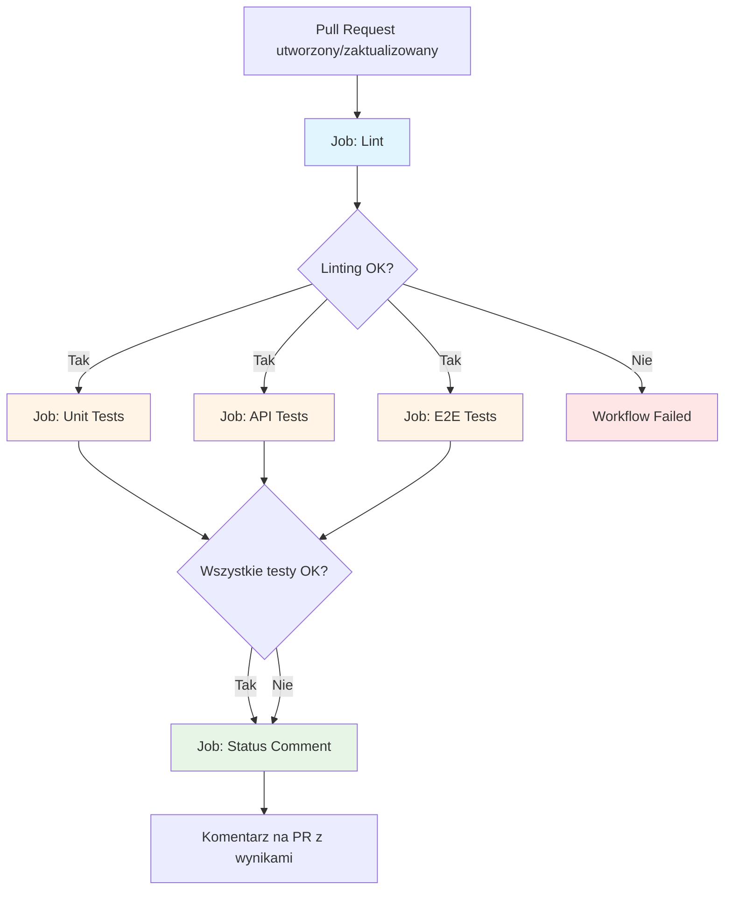

# Pull Request Workflow - Diagram

## Przepływ wykonania



## Szczegóły jobów

### 1. Lint (Sekwencyjny)
```
┌─────────────────────────────────┐
│         Job: Lint               │
├─────────────────────────────────┤
│ 1. Checkout code                │
│ 2. Setup Node.js 20             │
│ 3. npm ci                        │
│ 4. npm run lint (ESLint)        │
│ 5. prettier --check .           │
└─────────────────────────────────┘
```

### 2-4. Testy (Równolegle po Lint)
```
┌──────────────────┐  ┌──────────────────┐  ┌──────────────────┐
│  Unit Tests      │  │   API Tests      │  │   E2E Tests      │
├──────────────────┤  ├──────────────────┤  ├──────────────────┤
│ • Vitest         │  │ • Supabase CLI   │  │ • Playwright     │
│ • Coverage       │  │ • Bash scripts   │  │ • 3 browsers     │
│ • (placeholder)  │  │ • Environment    │  │ • (placeholder)  │
└──────────────────┘  └──────────────────┘  └──────────────────┘
```

### 5. Status Comment (Po wszystkich testach)
```
┌─────────────────────────────────┐
│    Job: Status Comment          │
├─────────────────────────────────┤
│ 1. Sprawdź wyniki wszystkich    │
│ 2. Wygeneruj tabelę ze statusem │
│ 3. Dodaj/zaktualizuj komentarz  │
│    na Pull Request              │
└─────────────────────────────────┘
```

## Timeline wykonania

```
0s    ┌─────────┐
      │  Lint   │
      └────┬────┘
           │
20s   ┌────┴────┬──────────┬──────────┐
      │  Unit   │   API    │   E2E    │
      │  Tests  │  Tests   │  Tests   │
      └────┬────┴────┬─────┴────┬─────┘
           │         │          │
60s        └─────────┴──────────┘
                    │
                    ▼
              ┌──────────┐
              │ Comment  │
              └──────────┘
70s
```

*Czasy są przykładowe i mogą się różnić w zależności od ilości testów*

## Przykładowy komentarz na PR

```markdown
## Pull Request CI Status

✅ All checks passed successfully!

### Test Results:

| Job | Status | Result |
|-----|--------|--------|
| Linting | ✅ | `success` |
| Unit Tests | ✅ | `success` |
| API Tests | ✅ | `success` |
| E2E Tests | ✅ | `success` |

---

Triggered by commit: a1b2c3d
```

## Struktura plików

```
.github/
└── workflows/
    ├── pull-request.yml    # ← Główny workflow
    └── README.md           # Dokumentacja

tests/
├── api/                    # ✅ Testy API (działają)
│   ├── *.test.sh
│   └── test-helpers.sh
├── unit/                   # ⏳ Testy jednostkowe (do skonfigurowania)
│   ├── README.md
│   ├── example.test.ts
│   └── setup.example.ts
└── e2e/                    # ⏳ Testy E2E (do skonfigurowania)
    ├── README.md
    └── login.example.spec.ts

playwright.config.example.ts  # Przykład konfiguracji Playwright
vitest.config.example.ts      # Przykład konfiguracji Vitest
```

## Sekrety i zmienne środowiskowe

```yaml
Environment: integration
├── SUPABASE_URL          # URL instancji Supabase
├── SUPABASE_KEY          # Anon key
└── OPENROUTER_API_KEY    # Klucz OpenRouter API
```

## Triggery workflow

Workflow uruchamia się automatycznie gdy:
- ✅ Utworzysz nowy Pull Request
- ✅ Zaktualizujesz (push) istniejący Pull Request
- ✅ Ponownie otworzysz zamknięty Pull Request

Branches:
- `master`
- `main`
- `develop`

## Artifacts (dostępne po uruchomieniu testów)

Po włączeniu testów jednostkowych i E2E:

```
Artifacts/
├── unit-coverage/          # Pokrycie kodu testami jednostkowymi
├── playwright-report/      # Raport z testów E2E
└── e2e-coverage/          # Pokrycie kodu testami E2E
```

## Troubleshooting Flow

```
Workflow nie działa?
    │
    ├─→ Sprawdź permissions (pull-requests: write)
    ├─→ Sprawdź czy plik jest w .github/workflows/
    ├─→ Sprawdź składnię YAML
    └─→ Sprawdź logi w Actions tab
    
Testy nie przechodzą?
    │
    ├─→ Sprawdź czy sekrety są skonfigurowane
    ├─→ Sprawdź environment: integration
    ├─→ Uruchom testy lokalnie: npm test
    └─→ Sprawdź logi konkretnego joba
    
Komentarz się nie dodaje?
    │
    ├─→ Sprawdź permissions
    ├─→ Sprawdź GITHUB_TOKEN
    └─→ Sprawdź logi joba status-comment
```

## Resources

- [GitHub Actions Documentation](https://docs.github.com/en/actions)
- [Workflow Syntax](https://docs.github.com/en/actions/reference/workflow-syntax-for-github-actions)
- [GitHub Script Action](https://github.com/actions/github-script)
